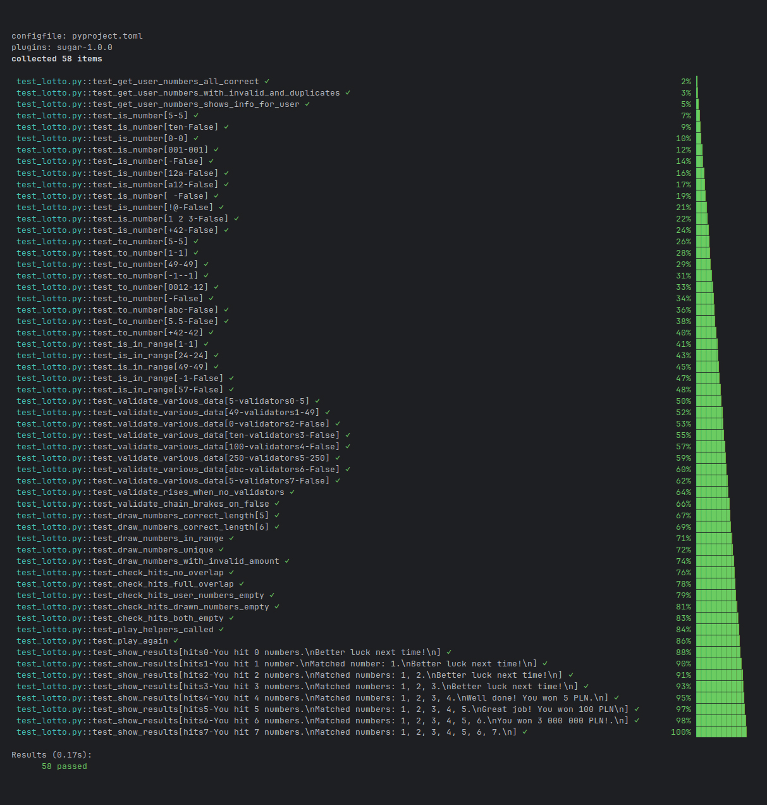

# 🎲 Lotto CLI Game with TDD

   


This is a simple Lotto number picker and simulator for the command line, created to practice **Test-Driven Development (TDD)** using **pytest**, **pytest-sugar**, and tools like `monkeypatch`, `capfd`, and `parametrize`.

The game allows users to input their Lotto numbers, generates random winning numbers, compares the selections, and displays the results in a clear format.

---

## 🚀 Features

✅ Validates user-provided input  
✅ Draws unique Lotto numbers (1–49)  
✅ Compares selections and displays matches  
✅ Shows prize messages based on the number of hits  
✅ Interactive play-again loop  
✅ 100% test coverage with 58 test cases  
✅ Uses `pytest-sugar` for modern test UI  

---

## 📦 Dependencies

- Python 3.11+
- [`uv`](https://github.com/astral-sh/uv)
- `pytest`
- `pytest-sugar`

---

## 🔧 Installation & Usage

After cloning the repository:

```bash
uv venv
source .venv/bin/activate
uv sync
```

To run the game:

```bash
python lotto.py
```

The default number of picks is 7 — you can change that in the `play(amount)` call in `lotto.py`.

---

## 🧪 Running Tests

Run all tests with:

```bash
pytest -v --tb=short
```

> Requires `pytest` and `pytest-sugar`, both included in `pyproject.toml`.

---

## ✅ Example Test Output

This project includes **58 tests**. Example test run with `pytest-sugar`:

```bash
plugins: sugar-1.0.0
collected 58 items                                                                                                                                                                                                        

 test_lotto.py::test_get_user_numbers_all_correct ✓                                                                                                                                                           2% ▎         
 test_lotto.py::test_get_user_numbers_with_invalid_and_duplicates ✓                                                                                                                                           3% ▍         
 test_lotto.py::test_get_user_numbers_shows_info_for_user ✓                                                                                                                                                   5% ▌         
 test_lotto.py::test_is_number[5-5] ✓                                                                                                                                                                         7% ▊         
 test_lotto.py::test_is_number[ten-False] ✓                                                                                                                                                                   9% ▉         
 test_lotto.py::test_is_number[0-0] ✓                                                                                                                                                                        10% █         
 test_lotto.py::test_is_number[001-001] ✓                                                                                                                                                                    12% █▎        
 test_lotto.py::test_is_number[-False] ✓                                                                                                                                                                     14% █▍        
 test_lotto.py::test_is_number[12a-False] ✓                                                                                                                                                                  16% █▋        
 test_lotto.py::test_is_number[a12-False] ✓                                                                                                                                                                  17% █▊        
 test_lotto.py::test_is_number[ -False] ✓                                                                                                                                                                    19% █▉        
 test_lotto.py::test_is_number[!@-False] ✓                                                                                                                                                                   21% ██▏       
 test_lotto.py::test_is_number[1 2 3-False] ✓                                                                                                                                                                22% ██▎       
 test_lotto.py::test_is_number[+42-False] ✓                                                                                                                                                                  24% ██▌       
 test_lotto.py::test_to_number[5-5] ✓                                                                                                                                                                        26% ██▋       
 test_lotto.py::test_to_number[1-1] ✓                                                                                                                                                                        28% ██▊       
 test_lotto.py::test_to_number[49-49] ✓                                                                                                                                                                      29% ██▉       
 test_lotto.py::test_to_number[-1--1] ✓                                                                                                                                                                      31% ███▏      
 test_lotto.py::test_to_number[0012-12] ✓                                                                                                                                                                    33% ███▍      
 test_lotto.py::test_to_number[-False] ✓                                                                                                                                                                     34% ███▌      
 test_lotto.py::test_to_number[abc-False] ✓                                                                                                                                                                  36% ███▋      
 test_lotto.py::test_to_number[5.5-False] ✓                                                                                                                                                                  38% ███▊      
 test_lotto.py::test_to_number[+42-42] ✓                                                                                                                                                                     40% ████      
 test_lotto.py::test_is_in_range[1-1] ✓                                                                                                                                                                      41% ████▎     
 test_lotto.py::test_is_in_range[24-24] ✓                                                                                                                                                                    43% ████▍     
 test_lotto.py::test_is_in_range[49-49] ✓                                                                                                                                                                    45% ████▌     
 test_lotto.py::test_is_in_range[-1-False] ✓                                                                                                                                                                 47% ████▋     
 test_lotto.py::test_is_in_range[57-False] ✓                                                                                                                                                                 48% ████▉     
 test_lotto.py::test_validate_various_data[5-validators0-5] ✓                                                                                                                                                50% █████     
 test_lotto.py::test_validate_various_data[49-validators1-49] ✓                                                                                                                                              52% █████▎    
 test_lotto.py::test_validate_various_data[0-validators2-False] ✓                                                                                                                                            53% █████▍    
 test_lotto.py::test_validate_various_data[ten-validators3-False] ✓                                                                                                                                          55% █████▌    
 test_lotto.py::test_validate_various_data[100-validators4-False] ✓                                                                                                                                          57% █████▊    
 test_lotto.py::test_validate_various_data[250-validators5-250] ✓                                                                                                                                            59% █████▉    
 test_lotto.py::test_validate_various_data[abc-validators6-False] ✓                                                                                                                                          60% ██████    
 test_lotto.py::test_validate_various_data[5-validators7-False] ✓                                                                                                                                            62% ██████▎   
 test_lotto.py::test_validate_rises_when_no_validators ✓                                                                                                                                                     64% ██████▍   
 test_lotto.py::test_validate_chain_brakes_on_false ✓                                                                                                                                                        66% ██████▋   
 test_lotto.py::test_draw_numbers_correct_length[5] ✓                                                                                                                                                        67% ██████▊   
 test_lotto.py::test_draw_numbers_correct_length[6] ✓                                                                                                                                                        69% ██████▉   
 test_lotto.py::test_draw_numbers_in_range ✓                                                                                                                                                                 71% ███████▏  
 test_lotto.py::test_draw_numbers_unique ✓                                                                                                                                                                   72% ███████▎  
 test_lotto.py::test_draw_numbers_with_invalid_amount ✓                                                                                                                                                      74% ███████▌  
 test_lotto.py::test_check_hits_no_overlap ✓                                                                                                                                                                 76% ███████▋  
 test_lotto.py::test_check_hits_full_overlap ✓                                                                                                                                                               78% ███████▊  
 test_lotto.py::test_check_hits_user_numbers_empty ✓                                                                                                                                                         79% ███████▉  
 test_lotto.py::test_check_hits_drawn_numbers_empty ✓                                                                                                                                                        81% ████████▏ 
 test_lotto.py::test_check_hits_both_empty ✓                                                                                                                                                                 83% ████████▍ 
 test_lotto.py::test_play_helpers_called ✓                                                                                                                                                                   84% ████████▌ 
 test_lotto.py::test_play_again ✓                                                                                                                                                                            86% ████████▋ 
 test_lotto.py::test_show_results[hits0-You hit 0 numbers.\nBetter luck next time!\n] ✓                                                                                                                      88% ████████▊ 
 test_lotto.py::test_show_results[hits1-You hit 1 number.\nMatched number: 1.\nBetter luck next time!\n] ✓                                                                                                   90% █████████ 
 test_lotto.py::test_show_results[hits2-You hit 2 numbers.\nMatched numbers: 1, 2.\nBetter luck next time!\n] ✓                                                                                              91% █████████▎
 test_lotto.py::test_show_results[hits3-You hit 3 numbers.\nMatched numbers: 1, 2, 3.\nBetter luck next time!\n] ✓                                                                                           93% █████████▍
 test_lotto.py::test_show_results[hits4-You hit 4 numbers.\nMatched numbers: 1, 2, 3, 4.\nWell done! You won 5 PLN.\n] ✓                                                                                     95% █████████▌
 test_lotto.py::test_show_results[hits5-You hit 5 numbers.\nMatched numbers: 1, 2, 3, 4, 5.\nGreat job! You won 100 PLN\n] ✓                                                                                 97% █████████▋
 test_lotto.py::test_show_results[hits6-You hit 6 numbers.\nMatched numbers: 1, 2, 3, 4, 5, 6.\nYou won 3 000 000 PLN!.\n] ✓                                                                                 98% █████████▉
 test_lotto.py::test_show_results[hits7-You hit 7 numbers.\nMatched numbers: 1, 2, 3, 4, 5, 6, 7.\n] ✓                                                                                                      100% ██████████

Results (0.17s):
      58 passed
```




---

## 📂 Project Structure

```
.
├── lotto.py             # Main game logic
├── test_lotto.py        # Test suite (pytest)
├── pyproject.toml       # Project metadata and dependencies
├── uv.lock              # Locked dependencies
└── README.md            # Project description
```

---

## 🧠 Concepts Practiced

- Test-Driven Development (TDD)
- Parametrized testing
- Input mocking with `monkeypatch`
- Capturing console output (`capfd`)
- Function mocking (`unittest.mock`)
- Modern test feedback with `pytest-sugar`
- Managing environments & dependencies using `uv`

---


### 👤 Piotr Lipiński 🗓️ Finished: August 2025 📫 Contributions welcome!

---
<sub>
Created as part of a Python learning journey focused on mastering testing and development workflows with `pytest`, TDD, and modern tooling like `uv`.
Feel free to explore, learn from, fork, and extend the project.

</sub>
